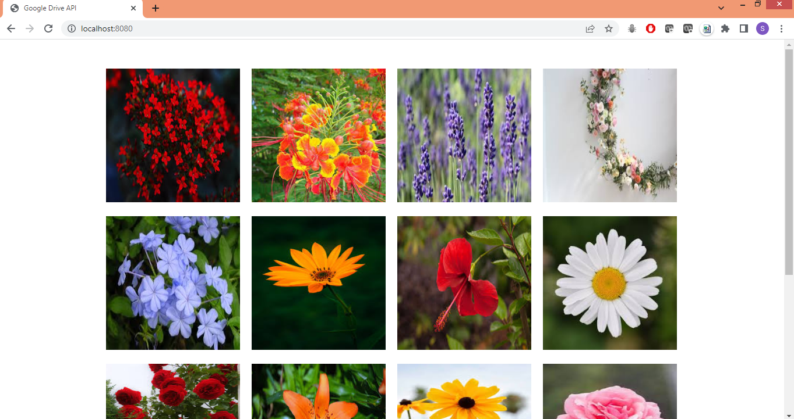
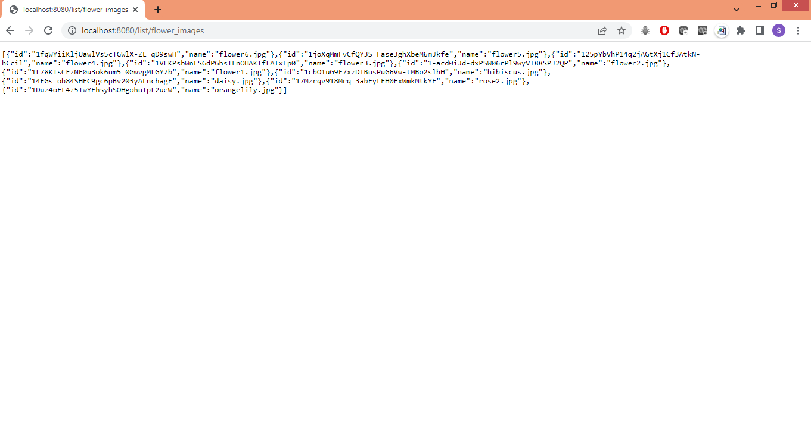

# spring-boot-google-drive-api
Spring Boot Web Application making calls to Google Drive API using OAuth credentials.

1. Enable Google Drive API on google developers console.
2. Create OAuth credentials and download JSON - https://www.youtube.com/watch?v=pBVAyU4pZOU
3. Provide the path to credentials.json in GoogleDriveConfig class.

##Screenshots - 
1. homepage

2. /list/flower_images

